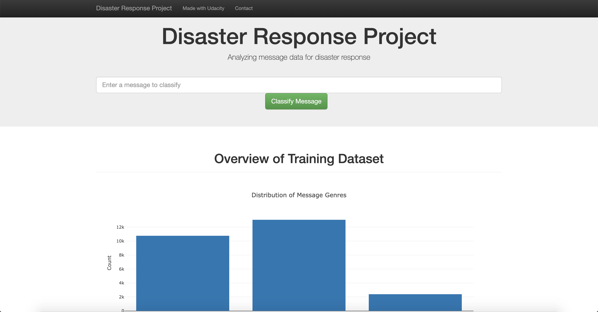

# Disaster Response Pipeline Project

### Instructions:
1. Run the following commands in the project's root directory to set up your database and model.

    - To run ETL pipeline that cleans data and stores in database
        `python data/process_data.py data/disaster_messages.csv data/disaster_categories.csv data/DisasterResponse.db`
    - To run ML pipeline that trains classifier and saves
        `python models/train_classifier.py data/DisasterResponse.db models/classifier.pkl`

2. Run the following command in the app's directory to run your web app.
    `python run.py`

3. Go to http://0.0.0.0:3001/

Project Organization
------------

    ├── README.md                       <- The top-level README for developers using this project
    ├── app
    │   ├── run.py                      <- Flask file that runs app
    │   └── templates                   <- HTML templates for Flask app
    │       ├── go.html                 <- classification result page of web app
    │       └── master.html             <- main page of web app
    │
    ├── data
    │   ├── disaster_categories.csv     <- data to process
    │   ├── disaster_messages.csv       <- data to process
    │   ├── DisasterResponse.db         <- database to save clean data to
    │   └── process_data.py             <- Python file that loads, cleans and saves data
    │
    ├── models
    │   └── train_classifier.py         <- Python file that loads, trains and explorts the final model
    │
    └── requirements.txt                <- The requirements file for reproducing the analysis environment

--------

### Homepage Screenshot

